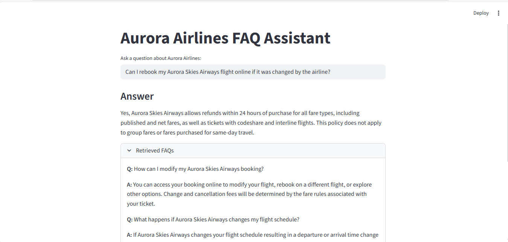
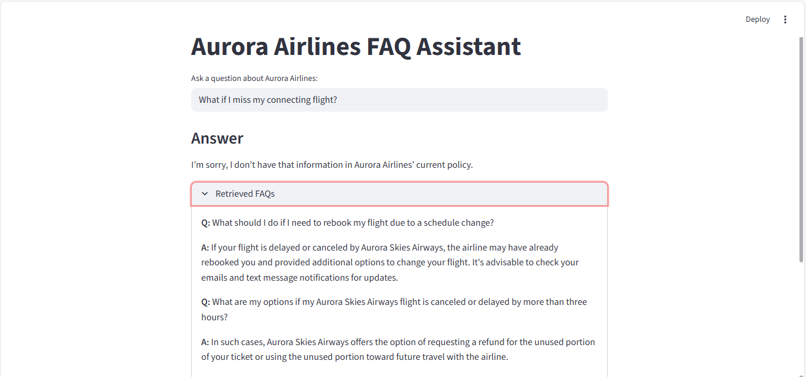

# Aurora Airlines FAQ Chatbot
This project implements a **Retrieval-Augmented Generation (RAG)** system designed to answer user questions based on a dataset of Aurora Airlines frequently asked questions (FAQs).

---

## Overview

The chatbot combines semantic search and generative AI to provide accurate and context-aware responses to user queries. It leverages modern NLP techniques to enhance customer support automation.

---

## Project Structure
### 1. **Data Loading and Processing**
- Loads the FAQ dataset.
- Generates embeddings for each question using a **Sentence Transformer** model.

### 2. **Retrieval**
- Uses **cosine similarity** to find the most relevant FAQs based on the user's query.

### 3. **Language Model Integration**
- Employs a pre-trained **Flan-T5** model to generate answers using the retrieved FAQs and the user query.

### 4. **Answer Validation**
- Validates the generated answer against the retrieved FAQ content to ensure factual consistency.

---

## Result Screenshots

